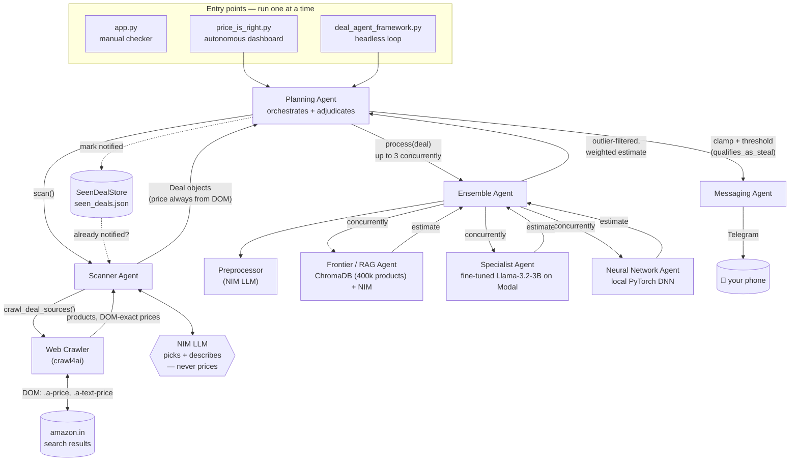
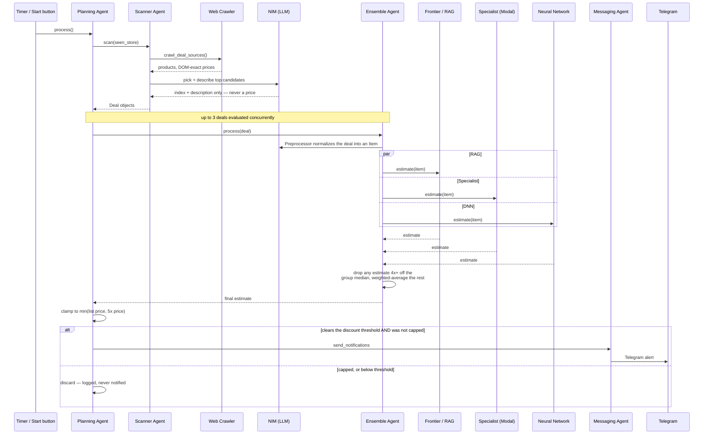

<h1 align="center">🕵️ StealTheDeal AI</h1>
<p align="center"><i>An ensemble of AI agents that watches live Amazon India listings and tells you, with real numbers, when something is genuinely underpriced.</i></p>

<p align="center">
  
  
  
  
</p>

---

## Table of Contents

- [What this is](#what-this-is)
- [Features](#features)
- [Architecture](#architecture)
  - [System overview](#system-overview)
  - [The three price estimators](#the-three-price-estimators)
  - [A scan cycle, step by step](#a-scan-cycle-step-by-step)
  - [Keeping the ensemble honest](#keeping-the-ensemble-honest)
  - [Staying inside NIM's rate limits](#staying-inside-nims-rate-limits)
  - [Three ways to run it](#three-ways-to-run-it)
- [Tech stack](#tech-stack)
- [Project structure](#project-structure)
- [Getting started](#getting-started)
- [Known limitations](#known-limitations)
- [A note on scraping Amazon](#a-note-on-scraping-amazon)
- [License](#license)
- [Acknowledgments](#acknowledgments)

---

## What this is

StealTheDeal AI is a personal project that hunts for underpriced products on Amazon India
and tells you about the good ones before anyone else notices. It's not a single model —
it's a small pipeline of cooperating agents: one that crawls real search results, one that
picks out the interesting candidates, and three independent estimators (a RAG pipeline over
a 400k-product catalog, a fine-tuned LLM, and a local neural network) that each form their
own opinion of what a product is actually worth. When their combined, sanity-checked opinion
says an item is worth meaningfully more than what it's listed for, you get a Telegram
notification with the numbers to back it up.

It started as an extended version of the "Price is Right" project from the *LLM
Engineering* course, and grew into something considerably more involved: live web crawling
instead of a static dataset, a three-model ensemble instead of one estimator, a
process-wide rate limiter with model-fallback chains for a flaky free-tier API, and a full
autonomous dashboard with per-agent live status.

The project is deliberately honest with itself about what it's good at and what it isn't
yet — see [Known limitations](#known-limitations) below. The plumbing (crawling, pricing,
deduplication, notification) is solid and has been verified end-to-end against live Amazon
data. The estimators' raw *accuracy* on live listings is still a work in progress, which is
exactly why so much of the design is about **not trusting any single number** — cross-
checking three independent models against each other and against prices actually read off
the page, rather than taking one model's word for it.

## Features

- **Live Amazon India crawling** — real search results, not a cached dataset, with prices
  read straight out of the page DOM rather than inferred by a model.
- **Three-model price ensemble** — a RAG pipeline (ChromaDB + LLM), a LoRA-fine-tuned
  Llama-3.2-3B served serverlessly on [Modal](https://modal.com), and a local PyTorch DNN,
  combined with measured (not guessed) weights.
- **Self-correcting ensemble** — a single wildly-off estimator gets excluded before
  averaging, and any estimate that blows past a sane ceiling gets clamped or the deal is
  dropped entirely rather than reported as a false "steal."
- **Resilient to a flaky free-tier LLM API** — every NIM call goes through a shared,
  process-wide rate limiter with ordered model-fallback chains, explicit timeouts, and
  automatic pause/resume, all visible live in the dashboard.
- **Three entry points** for three different needs: a one-off manual checker, a full
  autonomous dashboard, and a headless background loop.
- **Telegram alerts** with both the seller's own advertised discount *and* the model's
  independent estimate, kept clearly labeled as two different kinds of claim.

## Architecture

### System overview

Every agent in this pipeline has one job. The diagram below shows how a product goes from
"a row in an Amazon search result" to "a Telegram message on your phone," and nothing here
skips a step — the same objects (prices, URLs, estimates) flow through unchanged from where
they're first read to where they're finally displayed.



### The three price estimators

Each estimator sees the *same* normalized product description (title, category,
description — never a price; see [Keeping the ensemble
honest](#keeping-the-ensemble-honest) for why) and independently guesses what it's worth.

| Estimator | How it works | Measured median % error* | Ensemble weight |
|---|---|---|---|
| **Neural Network** ([`deep_neural_network.py`](agents/deep_neural_network.py)) | A local PyTorch DNN (10 residual blocks, hashed TF-IDF input) trained on the cleaned training set. Fastest, most accurate on the training distribution. | `15.1%` `███░░░░░░░░░░░░░░░░░` | **0.55** `███████████░░░░░░░░░` |
| **Specialist** ([`specialist_agent.py`](agents/specialist_agent.py)) | A LoRA-fine-tuned `Llama-3.2-3B`, served serverlessly on Modal (scales to zero when idle). | `32.3%` `██████░░░░░░░░░░░░░░` | **0.30** `██████░░░░░░░░░░░░░░` |
| **Frontier / RAG** ([`frontier_agent.py`](agents/frontier_agent.py)) | Embeds the product, retrieves the 5 nearest neighbours from a 400k-item ChromaDB catalog, and asks an LLM to estimate a price given that context. | `77.7%` `████████████████░░░░` | **0.15** `███░░░░░░░░░░░░░░░░░` |

\* Median absolute percentage error on a held-out split of the *training* distribution
(`notebooks/04_model_comparison.ipynb`). This is meaningfully better than what any of the
three achieve on live Amazon listings — see [Known limitations](#known-limitations).

The weights are roughly inverse-error (the most accurate model gets the most say) but
deliberately tempered: the DNN and Specialist were both trained on the same data, so they
share a "home-field advantage" that won't fully transfer to live listings, while RAG
retrieves from an independent catalog. They were set from these measured numbers, not
picked by hand — an earlier version had them almost backwards (RAG at 0.35, DNN at 0.45),
which dragged ensemble estimates well off the mark.

### A scan cycle, step by step

This is what happens, in order, every time a scan runs — whether it's triggered by clicking
**Start Scanning**, by the dashboard's recurring timer, or by the headless loop.



A few things worth calling out that aren't obvious from the diagram alone:

- **The LLM never touches a price, anywhere in this pipeline.** The Scanner's model picks
  which crawled products are interesting and writes a description; the price attached to
  the resulting `Deal` always comes from `product.price`, which was read out of the DOM by
  the crawler. This exists because the previous approach — asking a model to read a price
  out of page text — regularly returned the wrong number (a struck-through list price, a
  coupon amount, a neighbouring product's price).
- **Deals are deduplicated three times over**: within one crawl (the same product can
  legitimately surface under two different search queries), within one scan's LLM
  selection (by canonical URL, not just by index), and across every scan ever run, via
  [`agents/deal_store.py`](agents/deal_store.py)'s `seen_deals.json`, which persists across
  restarts.

### Keeping the ensemble honest

The three estimators are trained on a catalog whose median price is roughly ₹1,200; live
Amazon listings routinely run into the tens of thousands. Without a check on that mismatch,
one real run "valued" an ₹83,990 laptop at ₹614,358 — a 7.3x overestimate that would have
been reported as an 86% steal. Two independent guards now sit between a raw ensemble number
and a Telegram notification:

1. **Outlier rejection** ([`EnsembleAgent._reject_outliers`](agents/ensemble_agent.py)) —
   when all three estimators answer, the median of the three is a real datapoint (not a
   synthetic average), so any single estimate more than 4x away from it is dropped before
   the weighted average is computed, rather than being allowed to drag the blended number
   toward it.
2. **A hard ceiling, not just a list-price check**
   ([`agents/deal_evaluation.py`](agents/deal_evaluation.py)) — the estimate is clamped to
   `min(seller's list price, 5 × current price)`. The multiplier half of that matters even
   when a list price *is* shown: an inflated fake "was" price is a well-known e-commerce
   dark pattern, and a flat multiplier catches an unreasonable estimate that a fake MRP
   would otherwise wave through.

The important design decision here isn't the clamp itself, it's what happens **after** it:
a deal whose estimate needed clamping is never flagged as a steal at all, in the autonomous
pipeline. A capped number isn't an independent opinion anymore — it's just the seller's own
advertised discount reflected back — so reporting it as an AI-verified finding would be
overstating what the model actually confirmed. (The manual single-deal checker, `app.py`,
is the one exception: since a human explicitly asked about that specific item, it still
shows the capped result, clearly labeled, rather than saying nothing.)

### Staying inside NIM's rate limits

The free NVIDIA NIM tier caps out at 40 requests/minute, *account-wide* — shared across
every agent that calls it, not 40 each. [`agents/rate_limiter.py`](agents/rate_limiter.py)
enforces this with one process-wide sliding-window throttle that every NIM call passes
through before it's sent, plus:

- **Ordered model-fallback chains**, not single model names. The free tier is measurably
  flaky — in one 5-deal live run, the primary model in every chain returned genuine HTTP
  500s and a timeout, all within about four minutes. `call_with_model_fallback` walks the
  chain on a 404, timeout, or 5xx, so one bad model degrades quality slightly instead of
  failing the whole scan.
- **A real client-side timeout** (45s) with the SDK's own automatic retries turned off —
  otherwise a single acquired rate-limit slot could silently become up to three real HTTP
  requests, under-counting actual load against NIM's real limit.
- **Visible pause and resume.** When the limiter has to hold (either proactively, waiting
  for a slot, or reactively, after an actual 429), that agent's dashboard card shows
  **⏸️ paused — rate limit** instead of looking hung, and flips back to **🟢 working** the
  moment it resumes.

### Three ways to run it

| Entry point | What it's for | Notifies? | UI? |
|---|---|---|---|
| [`app.py`](app.py) | Manually type in one product's details and get an ensemble estimate on demand. | No | Simple Gradio form |
| [`price_is_right.py`](price_is_right.py) | The full experience: autonomous recurring scans, live per-agent status, a deals table. | Yes | Full dashboard |
| [`deal_agent_framework.py`](deal_agent_framework.py) | The same scan/estimate/notify loop as the dashboard, headless — for running unattended. | Yes | None (console only) |

Run only one at a time — each holds its own in-process 40 req/min NIM budget, so two
running simultaneously would each think they have the full quota and together blow past
NVIDIA's real, account-wide limit.

## Tech stack

| Layer | Choice |
|---|---|
| LLM inference | [NVIDIA NIM](https://build.nvidia.com) (free tier), OpenAI-compatible API |
| Fine-tuned model serving | [Modal](https://modal.com) (serverless GPU, scales to zero) |
| Vector search | [ChromaDB](https://www.trychroma.com/) + `sentence-transformers` |
| Local inference | PyTorch |
| Web crawling | [crawl4ai](https://docs.crawl4ai.com) (Playwright under the hood) |
| Dashboard UI | [Gradio](https://gradio.app) |
| Notifications | Telegram Bot API |
| Data validation | Pydantic |

## Project structure

```
StealTheDealAI/
├── agents/                  # every agent in the pipeline
│   ├── planning_agent.py    #   orchestrates a scan, adjudicates steal/not-steal
│   ├── scanner_agent.py     #   turns crawled products into Deal objects
│   ├── web_crawler.py       #   live Amazon India crawling (crawl4ai)
│   ├── preprocessor.py      #   normalizes a Deal into a structured Item
│   ├── ensemble_agent.py    #   runs + combines the 3 estimators
│   ├── frontier_agent.py    #   RAG estimator (ChromaDB + NIM)
│   ├── specialist_agent.py  #   fine-tuned LLM estimator (Modal)
│   ├── neural_network_agent.py  # local DNN estimator
│   ├── deal_evaluation.py   #   the single source of truth for "is this a steal?"
│   ├── rate_limiter.py      #   shared NIM throttle + model-fallback chains
│   ├── deal_store.py        #   cross-restart dedup (seen_deals.json)
│   └── messaging_agent.py   #   Telegram / console notifications
├── config/
│   ├── settings.py          #   every tunable, documented inline
│   └── .env.example         #   copy to .env and fill in your keys
├── modal_deployments/
│   └── pricer_service.py    #   the Specialist agent's Modal deployment
├── notebooks/                # data exploration, training, fine-tuning, comparison
├── scripts/                  # one-off data-pipeline scripts (see SETUP.md)
├── app.py                    # entry point: manual checker
├── price_is_right.py         # entry point: autonomous dashboard
├── deal_agent_framework.py   # entry point: headless loop
└── SETUP.md                  # full step-by-step setup, from raw data to a live deploy
```

## Getting started

The full walkthrough — downloading the training data, training the DNN and fine-tuning the
LLM on Kaggle's free GPUs, deploying the Specialist to Modal, and launching each of the
three entry points — is in **[SETUP.md](SETUP.md)**. The short version, if you just want to
see it estimate a price:

```bash
git clone https://github.com/DamnKuldeep/StealTheDealAI.git
cd StealTheDealAI
pip install -r requirements.txt
cp config/.env.example config/.env   # fill in at least NIM_API_KEY
python app.py
```

That gets you the manual checker running on the RAG estimator alone (the DNN and Specialist
will report "not available" until you've completed their respective setup steps in
SETUP.md). For live Amazon crawling and the full dashboard, SETUP.md has the rest.

## Known limitations

**The estimators are more reliable at rejecting bad numbers than at producing great ones.**
The guards described in [Keeping the ensemble
honest](#keeping-the-ensemble-honest) stop the pipeline from reporting absurd,
self-contradicting results — and they're proven to work: in one live test scan, 3 of the 5
qualifying "steal" candidates needed the ceiling clamp to stay plausible.
But raising a ceiling and improving the number underneath it are different problems. The
underlying accuracy gap — measured medAPE of 15-78% on the *training* distribution, worse
on live listings whose price range the training catalog barely covers — is a data problem,
and the real fix is retraining on Amazon-distribution data, not more clamping. SETUP.md's
[Known limitation](SETUP.md#known-limitation-estimate-quality-on-live-listings) section has
the details and the path to actually improving it.

## A note on scraping Amazon

This project reads live product listings from `amazon.in`. Two things are worth being
upfront about, and are documented in more depth in SETUP.md:

- `amazon.in/robots.txt` permits `/dp/` product pages and plain `/s?k=` keyword search for
  `User-agent: *` — the code was written to only ever use those permitted paths, and never
  builds the disallowed faceted search form. That said, robots.txt permission is not the
  same as Amazon's Conditions of Use, which separately prohibit automated data extraction.
  The officially sanctioned route for Amazon price data is the **Product Advertising API**,
  and that's the right choice if this project ever grows beyond personal, hobby-scale use.
- The crawler identifies itself honestly (a descriptive `User-Agent`, no proxy rotation, no
  CAPTCHA solving) and self-throttles on purpose (`CRAWL_DELAY_SECONDS`,
  `CRAWL_QUERIES_PER_SCAN`) to stay at a trickle rather than push the actual limits of what
  it could get away with.

## License

[MIT](LICENSE) — see the LICENSE file for the full text.

## Acknowledgments

Originally grew out of the "Price is Right" project from the *LLM Engineering* course,
extended well past its original scope: live crawling instead of a static dataset, a
three-model ensemble instead of one, a resilient rate-limiting layer for a real free-tier
API, and a full autonomous dashboard.
